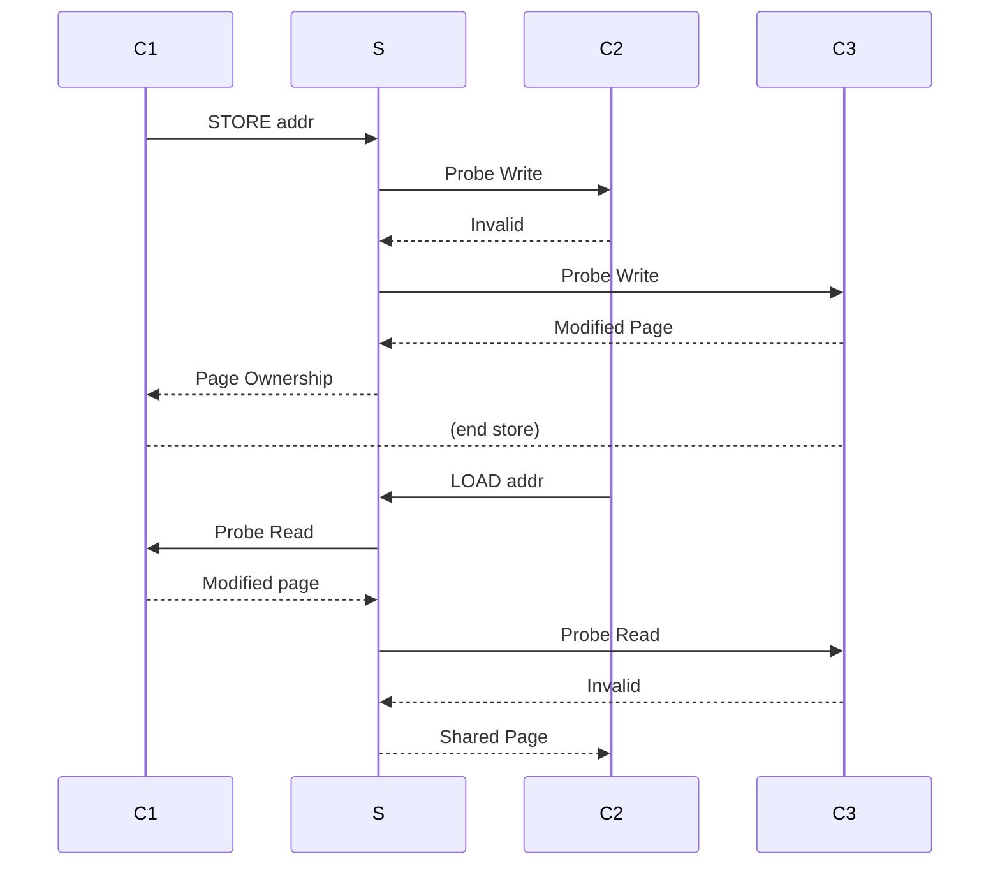

# Signal-Based Distributed Shared Memory System  
  
Our signal-based distributed shared memory system is a segfault handling based implementation of shared memory for  
amd64 GNU/Linux systems.  
  
## System Design  
dsm has two main components:  
 - n clients
 - a centralized server

  
Some pages are stored on clients, each of which contains a private 'page cache' that maps addresses to MESI-state. (this is not to be confused with the filesystem related page cache)  
When needed data is not present on a client, it queries the server for the page (which may be stored on other clients);  
The server then asks every client whether they have the page, (see load/store rpc),  
This behavior is implented twice, as loads require slightly different logic compared to stores to maintain coherence in MESI.  
  
We use a SIGSEGV signal handler to detect when pages are written/read, the handler invokes the previously mentioned  
RPCs to get up to date information before changing protections to reflect the state in the MESI protocol.  
  
The topology of the distributed shared memory is best described as a hub and spoke model. All communications go through the 'server', which substantially simplifies our implementation and argument for correctness, at a cost of a little more latency.  
  
### Preload  
We use LD_PRELOAD to hook dynamically linked functions - in particular, intercept calls to mmap. Instead of allowing any protections to be set when we mmap a page, we instead always set the protection to PROT_NONE - this allows us to intercept any writes to the page upon access, and handle the corresponding signal.  
  
### Networked Illinois Protocol  
In our initial proposal, we had intented to use the MOESI cache coherence protocol just with page granularity. 
This makes some sense since the protocol is often implemented on smaller networks, that being between less than a few dozen CPU cores. As such, we do figure this will have issues scaling.
Unfortunately, the Owned state in MOESI adds complexity and more importantly only benefits non-writeback caches.  
That is to say, since we send everything through 'main memory' (in this case, the server), we get no benefit from the added complexity of MOESI.  
The graph below illustrates how the RPC's look as MESI handles the following scenario, where C3 originally owns some data:

 1. First, C1 writes to some shared memory address, getting it in Modified 
 2. Later C2 reads that same address, downgrading C1 to from Modified to Shared

  Note that at no point, do any clients talk to eachother directly. Also, note that the last Probe read was unnecessary. This could be optimized.
### cRPCs  
Unix sockets are in essence just fancy bidirectional fifo's and generously abstract away the notion of dealing with  
packets and whatnot for us, our really barebones system is named cRPC is in part inspired by some of gRPC's shortcomings, though in reality it made us appreciate gRPC's automatic serialization, thread safety, etc.  
The way it works is inspired heavily by how syscalls are implemented. We simply write the 'rpc number' (analagous to a syscall number), and send the arguments and an output buffer, which are as of current fixed size. Since reads block, this basically just turns into a synchronous rpc on another system. Unfortunately, this scheme currently does not handle concurrency at all, and is prone to some failures (probes send data, potentially corrupting a client's state if it's waiting to recv an RPC)  
  
  
### Signal Based page-cache Coherence  
We used sigaction to handle page faults. Whenever we allocated a relevant page, we always set the protections to none.  
We then ask the server for the relevant page and get its location. Then, we will reprotect the page using mprotect to give it read/write permissions, and finally the corresponding read/write will be executed.  
  
In hindsight, userfaultfd would have been a better idea here as it allows atomicity with respect to the state of a page.  
We initially thought that userfaultd didn't give us access to read based faults, so we switched to signal handlers; however, we later found out that it was still possible as MADV_DONTNEED is guaranteed to evict pages, making it similar to mprotect with PROT_NONE.  
  
#### Linux Lacks VirtualProtectEx()  
Linux doesn't support virtualprotectEx (which allows one program to change protection of mappings in other programs).  
Therefore, we can't have our clients be in different address spaces as we need to directly change protections levels from a client; thus the decision to use a shared library.  
Userfaultfd would work with this a little bit, we can write protect ranges, but cannot madvise externally, thus we do have to actually modify the program at runtime to be able to see reads.  
  
## Known Issues  
  
### Safety  
This program has a lot of pitfalls when it comes to thread safety, this is because we can not normally atomically write and write protect a page. As a result, if two threads are writing, it is possible that one thread will fault, the other will fail to fault because the page was unprotected in cstore and is immediately get clobbered by the memcpy in cstore. We do not know of a fix for this sans moving to userfaultfd, which explicitly supports copying a data into a page to resolve a fault.  

### ASLR
ASLR (Address Space Layout Randomization) a security mechanism that mitigates binary exploitation, and is enabled by default in compilation. In order for our workers to coordinate correctly, they have to agree on what addresses store what data. One possible way is to treat addresses as signed offsets from the base of the binary, or in the example code of our client, mmap'ing memory with a hyper-specific address chosen. We have elected to do the simple solution, and declare that ASLR is for the weak who cannot write safe code to begin with.
  
### Atomic Instructions  
Atomic instructions on x86-64 are architecturally defined to still remain atomic on x86, even across cache or even page lines. Currently, our code doesn't explicitly handle instructions but they do fault as writes, and will only go through should we hold both pages.  
In principle, an atomic instruction should work given the issue mentioned in the section above is resolved.  
  
### Heterogenous Arch  
Fortunately, we only support x86-64 as our signal handler depends on architecture specific flags to be set to detect whether the segfault was a read or write. It should be noted that pages are sent byte-for-byte, which means little endian cannot mix with big endian.  
  
### Statically linked binaries
Plenty of binaries are statically linked, be it to avoid the overhead of the procedure linkage table, for security, or reliability. Our LD_PRELOAD trick works, albeit we no longer get to hook functions. 

## Applications  
### Matrix Multiplication  
  
We can use our DSM server on matrix multiplication. Consider the following setup:  
- $m$ by $n$ matrix $A$  
- $n$ by $p$ matrix $B$  
Then we can distribute the matrices $A[:m/2, :], A[m/2:, :], B[:, :p/2], B[:, :p/2]$ into $4$ memory locations,  
and use $4$ clients to multiply these matrices ($A[:m/2, :] * B[:, :p/2]$ and so forth).  
The locations of these matrices are sharded but we sill need to access them, hence the use of our DSM server.  

